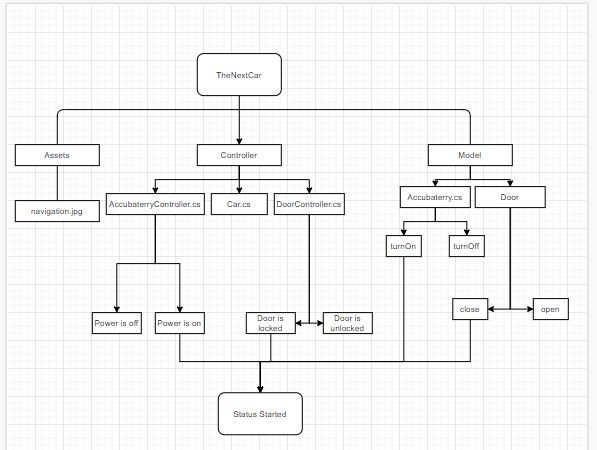

# Car Dashboard

Nama : Nur Fikri
NIM : 19.11.2790
Kelas : IF 03

### Class Diagram

### Kegunaaan DoorController.cs

DoorController.cs berisi intruksi yang berfungsi mengaktifkan DoorOpenButton

### Kegunaan ModelDoor.cs

Door.cs mempunyai fungsi untuk menampilkan dara status dari pintu, apakah pintu closed (Tertutup) atau Opened (Terbuka) pada tombol yang telah ditekan

### Kegunaan interface OnDoorChanged

OnDoorChanged berfunsi ntuk mengambil data pada LockDoorState.Content yang berisi pesan dan data LockDoorButton.Content yang berisi data tombol yang telah ditekan
